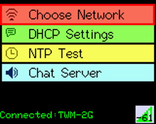
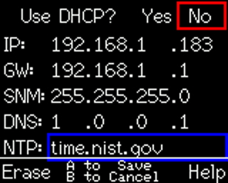
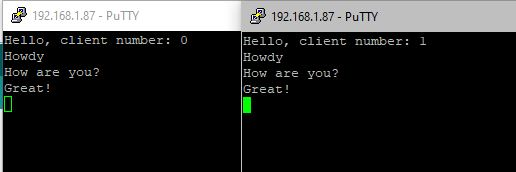

First off, huge thanks to the CircuitMess team and shoutout to Frank Prindle (https://community.circuitmess.com/u/frankprindle) for the
first draft of this code. It is definitely a WIP, but the hope is to expand it into a full WiFi utility for Ringo.

 

**v1.0.4 - WeCanHazFancyMenus!**

When the app starts, you're shown the **Main Menu**:
 * **Choose Network** - _Always start here_. You'll need to connect to your Wifi network before you do anything else. _**NEW! When you successfully connect to a network, these settings will be saved on the SD card and loaded on app start to allow for automatic reconnection to your last used network.**_ While at Main Menu, pressing either `Softkey` will disconnect/reconnect the WiFi network. **NOTE: WiFi Password is saved to SD card in plaintext!**
 * **DHCP Settings** - This will allow you to specify network settings like IP, DNS, NTP server, etc
 * **NTP Test** - The first test added to this app, originally written by Frank Prindle.
 * **Chat Server** - A Telnet chat server for multiple clients to connect to. PuTTY works well with this (duplicate multiple sessions to see it in action). Messages sent by one client are sent to all other connected clients.
 
If you attempt to access NTP Test or Chat Server without being connected to Wifi, the app will first attempt to connect to your saved network. If that fails, you will receive a prompt telling you to connect first. Pressing the B button from within a test or settings menus will take you back to the Main Menu. Pressing HOME will bring up the homePopup() menu, allowing you to adjust settings or exit the program and return to the Ringo Loader.

-----
**DHCP Settings Menu:**
 * `Joystick` will move between the fields; including `left-right` to move between octets, with exception to the DHCP option where `left-right` toggles the option
 * `Left Softkey` will Erase the currently selected field (setting octet to 0)
 * The NTP field uses the standard Ringo text input routine (`Right Softkey` for Help) and you may enter a hostname or IP here
 * Press `A` at any time to Save and Apply your new settings. Assuming you haven't disconnected WiFi manually from the Main Menu, you will be reconnected with your new settings
 * Press `B` at any time to Cancel and revert to your previously saved settings
-----
**NTP Test Instructions:**
 * This app simply checks in with an NTP server via UDP every 10 seconds. This will allow you to test the relative stability of your wifi connection. Repeated failures to contact the NTP server could indicate a poor connection quality..
 * Press `A` to select a new WiFi Network
 * Press `B` to return to the Main Menu
-----
**Chat Server Instructions:**
 * This app will show you the current IP of the Ringo (and a reminder that telnet is port 23). Use a telnet client like PuTTY to connect. 
 * To see it actually work, you need more than one client connected at a time, as messages will not be repeated on the originating client.
 * Press `B` to return to the Main Menu
 * _KNOWN BUG: After you have run the Chat Server once, you'll have to reboot before it can be ran again. Connections will be refused on subsequent runs without reboot. Still sorting this out. You will be reminded to reboot if you try to run it a second time._
-----
_**Recent Changes:**_
 * Made DHCP Settings menu prettier
 * DHCP Settings menu is now available. You can turn DHCP on/off and manually specify your IP/GW/SubnetMask/DNS/NTP settings.
 * FIX: Connecting to Open/password-less networks was not being saved properly.
 * Now your last used WiFi network is saved to the SD card and we try to reconnect to it on app launch. Press either softkey at Main Menu to Disconnect/Reconnect WiFi.
 * Added Telnet Chat Server
 * Added a live signal strength meter to the bottom status line
 * Added back homePopup() when you press the HOME button (fixed the restart issue)
 * mp.inCall (ability to sleep/save power) is now dynamically enabled/disabled as it makes sense to (WILL sleep at general menus, will NOT sleep during a test or while connecting to WiFi)

-----
_**Future Plans:**_
 * _More tests, like Ping, Tracenet, etc...and perhaps some more creative tests as they are thought of_
  
-----
_**Latest settings.txt format:**_
 * `[SSID]|[Pass(plaintext)]|[DHCP(bool)]|[DeviceIP]|[GatewayIP]|[SubnetMask]|[DNSserver]|[NTPserver]`

**Example:**
 * `TWM-2G|myPassW0rd|0|192.168.1.100|192.168.1.1|255.255.255.0|8.8.8.8|time.nist.gov`

_**NOTES on manually editing settings.txt:**_ 
 * The settings text must be the FIRST AND ONLY line in the file
 * Pipe `|` chars separate the parameters. So, if you leave settings blank, pipes must remain...I see 7 pipes above; that's what you should have, regardless of how many parameters are filled in! _(the app will fill in empty manual IPs with 0.0.0.0 when saving the file)_
 * A blank Pass is perfectly normal if you are using an open/unsecured WiFi
 * If the DHCP boolean is set to 1, the manual addresses will still be read, but not applied to the connection
 * If DHCP is 0, **all four** IP settings must be provided or DHCP will be used
 * NTP will default to `time.nist.gov` if not specified and custom NTP will be used even if DHCP is 1
 * You may use a hostname or IP address for NTP
