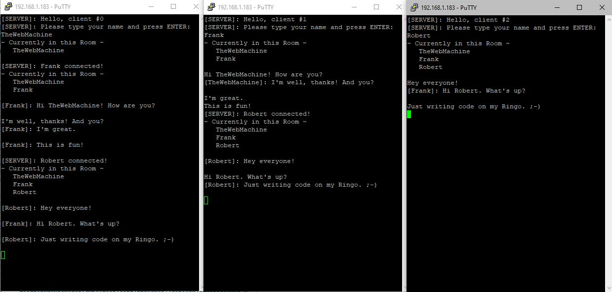

# WiFiTest - Ringo's first WiFi network testing app

First off, huge thanks to the CircuitMess team and shoutout to Frank Prindle (https://community.circuitmess.com/u/frankprindle) for the
first draft of this code. It is definitely a WIP, but the hope is to expand it into a full WiFi utility for Ringo.

## **v1.3.1 - I got your Chat Server right here!**

**Main Menu:**
 * **Choose Network** - You'll need to connect to your Wifi network before you do anything else. Your network settings are saved to the SD card
   * **NOTE: WiFi Password is saved to SD card in plaintext!**
   * **REMEMBER: Ringo only supports 2GHz WiFi Networks!**
 * **DHCP Settings** - This will allow you to specify network settings like IP, DNS, NTP server, etc
 * **► Tests Menu**
    * **NTP Test** - The first test added to this app, originally written by Frank Prindle
    * **Chat Server** - A Telnet chat server for multiple clients to connect to. 
      * PuTTY works well with this (duplicate multiple sessions to see it in action)
      * You'll be asked your name when you connect, allowing messages to be more easily identified by sender
      * Messages sent by one client are sent to all other connected clients, but _NOT_ to the originating client
      * Now with Command sequences! (See below)
 * **Update WiFiTest** - This will download the latest WiFiTest.bin from this repo to your SD card, _so you don't have to!_ It backs up the current version to WiFiTest.v###.bin before starting the download. Once new version is downloaded, you are taken back to the Ringo loader so you can launch the new version **(HUGE thanks to Frank for helping me to get this working!)**
 * `Left Softkey` will toggle the WiFi network connection on/off
 * `Right Softkey` will show Current Status screen with network information
 * If you attempt to access NTP Test or Chat Server without being connected to Wifi, the app will first attempt to connect to your saved network. If that fails, you will receive a prompt telling you to connect first
 * Pressing the `B` button from within a test or settings menus will take you back to the Main Menu
 * Pressing `HOME` will bring up the homePopup() menu, allowing you to adjust settings or exit the program and return to the Ringo Loader
-----
**DHCP Settings Menu:**
 * `Joystick` will move between the fields; including `left-right` to move between octets, with exception to the DHCP option where `left-right` toggles the option
 * `Left Softkey` will Erase the currently selected field (setting octet to 0)
 * The NTP field uses the standard Ringo text input routine (`Right Softkey` for Help) and you may enter a hostname or IP here
 * Press `A` at any time to Save and Apply your new settings. Assuming you haven't disconnected WiFi manually from the Main Menu, you will be reconnected with your new settings
 * Press `B` at any time to Cancel and revert to your previously saved settings
-----
**NTP Test Instructions:**
 * This app simply checks in with an NTP server via UDP every 10 seconds
 * This will allow you to test the relative stability of your wifi connection. Repeated failures to contact the NTP server could indicate a poor connection or network quality
 * You can specify a custom NTP server via the DHCP Settings menu
 * Press `Right Softkey` to show Current Status screen with network information
 * Press `A` to select a new WiFi Network
 * Press `B` to return to the Main Menu
-----
**Chat Server Instructions:**
 * This app will show you the current IP of the Ringo (and a reminder that telnet is port 23)
 * Use a telnet client like PuTTY to connect
 * You'll be asked for your Name when you connect. This is **mandatory** (do **not** leave blank; minor bug there) and will be used to identify your messages to other clients
 * To see it actually work, you need more than one client connected at a time, as messages will not be repeated on the originating client
 * Press `B` to return to the Main Menu
 * _The reboot bug has been fixed. You may now enter and exit the Chat Server as many times as you want; no reboot needed! :-)_
 * **NEW!** Command sequences are available and follow the format `~X param` where `X` is a single letter designation for the command being requested. `param` is optional depending on the command requested
    * `~L` - This will show you the list of connected clients. It takes no `param`
    * `~N NewName` - This lets you change your Name to `NewName`. Spaces are permitted in `NewName`

-----
-----
_**Recent Changes:**_
 * Major revamp to **Chat Server**: 
   * Added the first Command sequences (`~X param`)
   * Setting client's Name on connect
   * Show when client connects
   * Show a list of connected clients
   * Show which client sent message
   * Better Server messages to clients
   * Better filtering of message data to strip unwanted telnet garbage
   * increase message buffer to 5k to prevent fragmentation
 * FIX: Chat Server can now be ran multiple times without needing a reboot
 * Add Test Menu and move tests to that sub-menu
 * Added Splash screen at app launch
 * Added **Update WiFiTest** to download the latest .bin to your SD card
 * FIX: **DHCP Settings** page > NTP field was missing long text scrolling
 * Added **Current Status** screen (press `Right Softkey` at Main Menu or during NTP Test)
 * **DHCP Settings** menu is now available. You can turn DHCP on/off and manually specify your IP/GW/SubnetMask/DNS/NTP settings
 * FIX: Connecting to Open/password-less networks was not being saved properly
 * We now save WiFi network settings to SD/WiFiTest/settings.txt
 * Added Telnet **Chat Server**
-----
-----
_**Future Plans:**_
 * _More basic tests, like Ping, Tracenet, etc_
 * _A Captive Portal AP mode_
 * _Advanced Web Server hosting from SD card_
-----
-----
_**Latest settings.txt format:**_
 * `[SSID]|[Pass(plaintext)]|[DHCP(bool)]|[DeviceIP]|[GatewayIP]|[SubnetMask]|[DNSserver]|[NTPserver]`

**Example:**
 * `TWM-2G|myPassW0rd|0|192.168.1.100|192.168.1.1|255.255.255.0|8.8.8.8|time.nist.gov`

_**NOTES on manually editing settings.txt:**_ 
 * The settings text must be the FIRST AND ONLY line in the file
 * Pipe `|` chars separate the parameters. So, if you leave settings blank, pipes must remain...I see 7 pipes above; that's what you should have, regardless of how many parameters are filled in! _(the app will fill in empty manual IPs with 0.0.0.0 when saving the file)_
 * A blank Pass is perfectly normal if you are using an open/unsecured WiFi
 * If the DHCP boolean is set to 1, the manual addresses will still be read, but not applied to the connection
 * If DHCP is 0, **all four** IP settings must be provided or DHCP will be used
 * NTP will default to `time.nist.gov` if not specified and custom NTP will be used even if DHCP is 1
 * You may use a hostname or IP address for NTP
